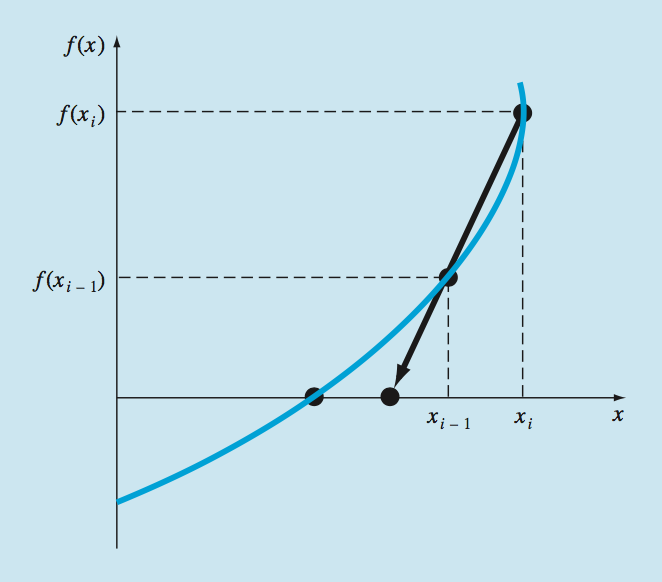
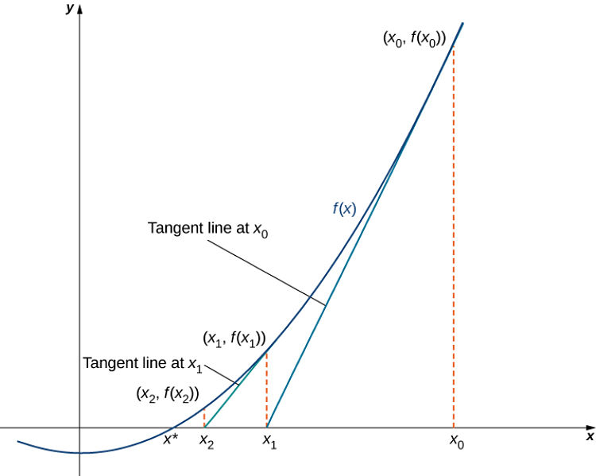
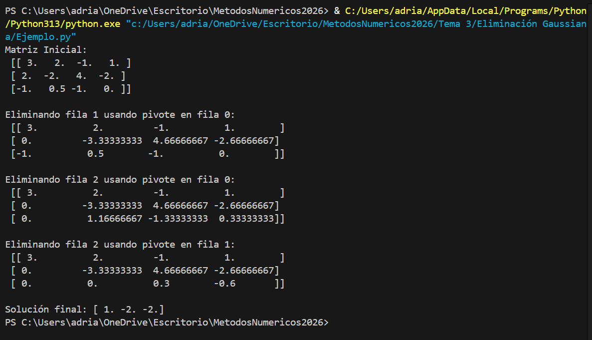
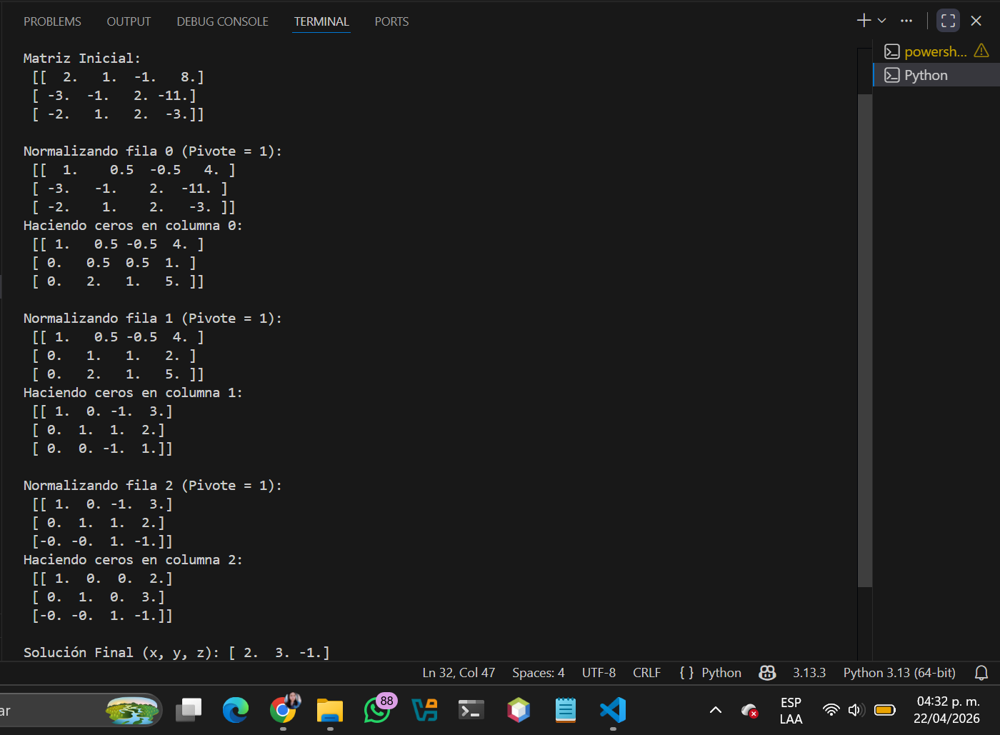
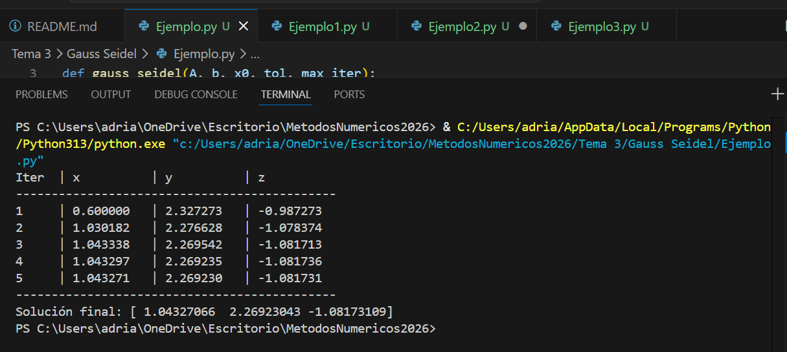
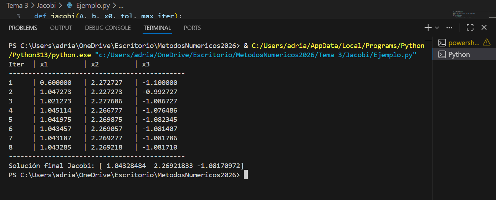

# MetodosNumericosItesa2025
>Divide y venceras

## Índice
* [Tema 1](#Tema_1)
   * 
* [Tema 2](#Tema_2)
   * [Bisección](#Bisección)
   * [Regla falsa](#Regla_Falsa)
   * [Secante](#Secante)
   * [Newton Rapson](#Newton_Rapson)
* [Tema 3](#Tema_3)
   * [Metodo de eliminación gaussiana](#MÉTODO_DE_ELIMINACIÓN_GAUSSIANA)
   * [Metodo de Gauss Jordan](#MÉTODO_DE_GAUSS_JORDAN)
   * [Metodo de Gauss Seidel](#Metodo_de_Gauss-Seidel)
   * [Metodo de Jacobi](#Metodo_de_Jacobi)
 * [Tema 4](#Tema_4)
   * [Metodos de diferencición](#Metodos_de_diferenciación)
     * [Regla de tres puntos](#Regla_de_tres_puntos)
     * [Regla de cinco puntos](#Regla_de_cinco_puntos)
   * [Metodos de integración](#Metodos_de_integraación)
     * [Metodo del Trapecio](#Metodo_del_Trapecio)
     * [Regla de Simpson](#Regla_de_Simpson)
     * [Método de la cuadratura gaussiana](#Método_de_la_cuadratura_gaussiana)
  * [Tema 5](#Tema_5)
    * [Metodos de interpolación](#Metodos_de_interpolación)
      * [Lineal](#Lineal)
      * [Cuadratica](#Cuadratica)
      * [Lagrange](#Lagrange)
      * [Newton](#Newton)
  * [Tema 6](#Tema_6)
    * [Metodos de extrapolación](#Metodos_de_extrapolación)
      * [Euler](#Euler)
      * [Runge-Kutta](#Runge-Kutta)
      * [Taylor](#Taylor)

# Tema_2

## Bisección

### Concepto
El método de bisección es un algoritmo utilizado para encontrar las raíces de una función en un intervalo dado.

### Algoritmo
1. Entrada de datos: Toma como entrada una función f(x) continua en un intervalo [a, b], donde f(a) y f(b) tienen signos opuestos (es decir, f(a) * f(b) < 0), y una tolerancia tol que determina la precisión deseada.

2. Inicialización: Define los límites del intervalo [a, b] y establece un contador de iteraciones.

3. Bucle de iteración:

   - Mientras el tamaño del intervalo (b - a) sea mayor que la tolerancia tol:
   
   - Calcula el punto medio c = (a + b) / 2.
   
   - Evalúa la función f(c).
   
       - Si f(c) es igual a cero (o está suficientemente cerca de cero según la tolerancia), devuelve c como la raíz.
   
       - Si f(c) tiene el mismo signo que f(a), actualiza a = c.
   
       - Si f(c) tiene el mismo signo que f(b), actualiza b = c.
   
    - Incrementa el contador de iteraciones.

5. Salida: Devuelve el punto medio c como la aproximación de la raíz.

### Implementación
* [Ejemplo base](./Tema%202/Bisección/Ejemplo.py)

### Ejercicios
* [Ejercicio 1](./Tema%202/Bisección/Ejemplo1.py)
* [Ejercicio 2](./Tema%202/Bisección/Ejemplo2.py)
* [Ejercicio 3](./Tema%202/Bisección/Ejemplo3.py)
* [Ejercicio 4](./Tema%202/Bisección/Ejemplo4.py)
* [Ejercicio 5](./Tema%202/Bisección/Ejemplo5.py)

## Regla_Falsa

<b>Concepto</b>

Algoritmo utilizado para encontrar aproximaciones de las raíces de una función continua en un intervalo dado. A diferencia del método de bisección, el método de la regla falsa utiliza una interpolación lineal para estimar la ubicación de la raíz en cada iteración.

<b>Algoritmo</b>

1. Entrada de datos: Toma como entrada una función  f(x)  continua en un intervalo [a, b], donde  f(a) y f(b) tienen signos opuestos, y una tolerancia text{tol}  que determina la precisión deseada.

2. Inicialización: Define a  y  b  como los límites del intervalo, y calcula  f(a)  y  f(b).

3. Bucle de iteración:
     - Mientras el tamaño del intervalo (b - a) / 2 sea mayor que la tolerancia  text{tol} :
       - Calcula el punto c de intersección con el eje x utilizando la interpolación lineal:
       c = b - ((f(b)*(b - a))/(f(b) - f(a))
       - Evalúa f(c).
       - Si  f(c) es igual a cero (o está suficientemente cerca de cero según la tolerancia), devuelve c como la raíz.
       - Si f(a)/f(c) < 0, actualiza b = c.
       - De lo contrario, actualiza a = c.

4. Salida: Devuelve c como la aproximación de la raíz.

<b>Implementación</b>

* [Ejemplo de Regla Falsa](./Tema%202/Regla%20Falsa/Ejemplo.py)

<b>Ejercicios</b>

### Ejercicios
* [Ejercicio 1](./Tema%202/Regla%20Falsa/Ejemplo1.py)
* [Ejercicio 2](./Tema%202/Regla%20Falsa/Ejemplo2.py)
* [Ejercicio 3](./Tema%202/Regla%20Falsa/Ejemplo3.py)
* [Ejercicio 4](./Tema%202/Regla%20Falsa/Ejemplo4.py)
* [Ejercicio 5](./Tema%202/Regla%20Falsa/Ejemplo5.py)

---

## Secante

  

<b>Concepto</b>

A diferencia de los métodos de intervalos como la regla falsa o la bisección, el método de la secante no requiere que la función cambie de signo en el intervalo dado. En cambio, utiliza dos aproximaciones iniciales para la raíz y calcula iterativamente una nueva aproximación utilizando una interpolación lineal entre los puntos definidos por las aproximaciones iniciales.

<b>Algoritmo</b>

1. Entrada de datos: Toma como entrada una función f(x)continua, dos aproximaciones iniciales x_0 y x_1  para la raíz, y una tolerancia tol que determina la precisión deseada.

2. Inicialización: Define x_0 y x_1 como las aproximaciones iniciales para la raíz.

3. Bucle de iteración:
   - Mientras no se alcance la tolerancia tol o un número máximo de iteraciones:
     - Calcula la siguiente aproximación de la raíz utilizando la fórmula:
       x_{n+1} = x_n - (f(x_n)*(x_n - x_{n-1})/(f(x_n) - f(x_{n-1})))
     - Comprueba si f(x_{n+1} < tol. Si es así, la aproximación x_{n+1} es aceptable y se detiene el algoritmo.
     - Actualiza x_{n-1} y x_n para la siguiente iteración.

4. Salida: Devuelve x{n+1} como la aproximación de la raíz.

<b>Implementación</b>

* [Ejemplo de Secante](./Tema%202/Secante/Ejemplo.py)

<b>Ejercicios</b>

* [Ejercicio 1](./Tema%202/Secante/Ejemplo1.py)
* [Ejercicio 2](./Tema%202/Secante/Ejemplo2.py)
* [Ejercicio 3](./Tema%202/Secante/Ejemplo3.py)
* [Ejercicio 4](./Tema%202/Secante/Ejemplo4.py)
* [Ejercicio 5](./Tema%202/Secante/Ejemplo5.py)

---

## Newton_Rapson

  

<b>Concepto</b>

El método de Newton-Raphson, también conocido como el método de Newton, es un algoritmo utilizado para encontrar raíces de funciones. Es un método iterativo que utiliza la derivada de la función para aproximarse a la raíz.
El concepto básico detrás del método de Newton-Raphson es usar la tangente a la curva de la función en un punto inicial como una aproximación lineal de la función. Luego, se encuentra la intersección de esta tangente con el eje 
x, que proporciona una mejor aproximación de la raíz de la función. Este proceso se repite iterativamente hasta que se alcance la precisión deseada.

<b>Algoritmo</b>

1. Entrada de datos: Toma como entrada una función  f(x) continua y diferenciable, una aproximación inicial  x_0 para la raíz, y una tolerancia tol que determina la precisión deseada.

2. Bucle de iteración:
   - Calcula la siguiente aproximación de la raíz utilizando la fórmula:
     x_{n+1} = x_n - (f(x_n)/f'(x_n))
     donde f'(x_n) es la derivada de f(x) evaluada en x_n.
   - Repite este paso hasta que |f(x_{n+1})| < tol, o hasta que se alcance un número máximo de iteraciones.

3. Salida: Devuelve x_{n+1} como la aproximación de la raíz.

<b>Implementación</b>

* [Ejemplo Base: Raíz de 2](./Tema%202/Newton/Ejemplo.py)

<b>Ejercicios</b>

* [Ejemplo 1: Función Polinómica](./Tema%202/Newton/Ejemplo1.py)
* [Ejemplo 2: Función Exponencial](./Tema%202/Newton/Ejemplo2.py)
* [Ejemplo 3: Función Trigonométrica](./Tema%202/Newton/Ejemplo3.py)
* [Ejemplo 4: Función Logarítmica](./Tema%202/Newton/Ejemplo4.py)
* [Ejemplo 5: Polinomio de tercer grado](./Tema%202/Newton/Ejemplo5.py)

---

# Tema_3

## MÉTODO_DE_ELIMINACIÓN_GAUSSIANA

 ###                                         Concepto

El objetivo del método de Gauss es transformar un sistema de ecuaciones lineales en otro equivalente pero más fácil de resolver, como un sistema triangular o diagonal con ceros bajo la diagonal.

<b>Algoritmo</b>

1. Pivoteo:
   
   - En esta fase, se elige un elemento pivotante en cada iteración del algoritmo. El pivote es crucial porque guía el proceso de simplificación del sistema.
   
   - El pivote se selecciona para minimizar los errores numéricos y facilitar los cálculos. En el método de Gauss original, se elige como el primer elemento no nulo en cada columna, pero existen variantes como el pivoteo parcial o completo para mejorar la precisión numérica.
   
2. Eliminación:
   
   - Después de seleccionar el pivote, se utiliza para eliminar los coeficientes debajo de él en la misma columna, haciendo que sean cero. Esto simplifica el sistema al eliminar incógnitas de ecuaciones adicionales.
   
   - La eliminación se realiza restando múltiplos adecuados de la fila del pivote a otras filas. Esto se repite hasta que la matriz se convierte en una forma triangular superior, donde todos los elementos debajo de la diagonal principal son ceros.
   
3. Sustitución hacia atrás:
   
   - Con la matriz en forma triangular superior, se pueden resolver las incógnitas fácilmente utilizando el método de sustitución hacia atrás.
   
   - Comenzando desde la última fila, las soluciones de las variables se calculan sucesivamente utilizando los valores ya calculados de las variables hacia abajo en la matriz.

<b>Implementación</b>

* [Ejemplo Detallado](./Tema%203/Eliminación%20Gaussiana/Ejemplo.py)

Por ultimo se muestran los resultados obtenidos

  

<b>Ejercicios</b>

* [Ejemplo 1: Sistema 2x2](./Tema%203/Eliminación%20Gaussiana/Ejemplo1.py)
* [Ejemplo 2: Sistema 3x3](./Tema%203/Eliminación%20Gaussiana/Ejemplo2.py)
* [Ejemplo 3: Sistema 4x4](./Tema%203/Eliminación%20Gaussiana/Ejemplo3.py)

---

## MÉTODO_DE_GAUSS_JORDAN

<b>Concepto</b>

El método de Gauss-Jordan es un algoritmo numérico utilizado para resolver sistemas de ecuaciones lineales. Su objetivo principal es llevar una matriz aumentada que representa el sistema de ecuaciones a su forma escalonada reducida por filas, obteniendo una matrz identidad. 

<b>Algoritmo</b>

1. Pivoteo Parcial:
   
   - Selecciona el pivote actual como el elemento más grande en valor absoluto en la columna actual, comenzando desde la fila actual y hacia abajo.
  
   - Intercambia las filas de tal manera que la fila del pivote (la fila actual) se coloque en la posición donde se encuentra el máximo elemento.

2. Hacer el Pivote Igual a 1:
   
    - Divide toda la fila del pivote por el valor del pivote para hacer que el elemento diagonal (el pivote) sea igual a 1.

3.  Hacer Ceros por Debajo y por encima del Pivote:
   
    - Para cada fila que esté debajo y por encima del pivote, resta múltiplos adecuados de la fila del pivote para hacer cero los elementos en la columna actual.

4. Repetición:

   - Repite los pasos anteriores para el siguiente pivote y continúa hasta que se hayan procesado todas las filas y columnas.

5. Solución:

   - Una vez que la matriz está en su forma escalonada reducida, las últimas columnas representan las soluciones del sistema de ecuaciones lineales.
   

<b>Implementación</b>

* [Ejemplo Detallado Paso a Paso](./Tema%203/Gauss%20Jordan/Ejemplo.py)

Por ultimo se muestran los resultados obtenidos

  

<b>Ejercicios</b>

* [Ejemplo 1: Sistema 2x2](./Tema%203/Gauss%20Jordan/Ejemplo1.py)
* [Ejemplo 2: Sistema 3x3](./Tema%203/Gauss%20Jordan/Ejemplo2.py)
* [Ejemplo 3: Sistema 4x4](./Tema%203/Gauss%20Jordan/Ejemplo3.py)

---

## Metodo_de_Gauss-Seidel

<b>Concepto</b>

El método de Gauss-Seidel es una técnica iterativa para resolver sistemas de ecuaciones lineales. En lugar de calcular todas las incógnitas simultáneamente como en el método de eliminación gaussiana, Gauss-Seidel calcula cada incógnita secuencialmente utilizando valores actualizados a medida que avanza en las iteraciones. Esto hace que el método sea especialmente útil para matrices grandes y dispersas.

El proceso comienza con una aproximación inicial de las soluciones del sistema. Luego, en cada iteración, Gauss-Seidel actualiza las soluciones basándose en las estimaciones previas, utilizando los valores recientemente calculados para las incógnitas. Este enfoque iterativo continúa hasta que se alcanza un cierto criterio de convergencia, como una tolerancia predefinida o un número máximo de iteraciones.

<b>Algoritmo</b>

1. Descomposición de la matriz: Dada una matriz A de coeficientes y un vector b de términos independientes, se descompone A en dos matrices: L, la parte triangular inferior de A (incluida la diagonal); y U, la parte triangular superior de A sin incluir la diagonal.

2. Inicialización: Se elige una estimación inicial x^(0).

3. Iteraciones: Se itera el proceso hasta que se alcance una precisión deseada o un número máximo de iteraciones. En cada iteración:

   a. Se actualiza cada componente de x utilizando la fórmula iterativa:
   
       x_i^(k+1) = 1/a_ij (b_i − ∑_j=1^i−1 a_ij*x_j^(k+1) −∑_j=i+1^n a _ij*x_j^(k))

   b. Se comprueba si se ha alcanzado la precisión deseada. Si es así, se detiene el proceso. Si no, se continúa a la siguiente iteración.

4. Salida: La solución aproximada x ^(k) se toma como la solución del sistema de ecuaciones lineales Ax=b.

<b>Implementación</b>

* [Ejemplo con Tabla de Iteraciones](./Tema%203/Gauss%20Seidel/Ejemplo.py)

  

<b>Ejercicios</b>

* [Ejemplo 1: Sistema 3x3](./Tema%203/Gauss%20Seidel/Ejemplo1.py)
* [Ejemplo 2: Sistema 2x2](./Tema%203/Gauss%20Seidel/Ejemplo2.py)
* [Ejemplo 3: Sistema 4x4](./Tema%203/Gauss%20Seidel/Ejemplo3.py)

---

## Metodo_de_Jacobi

<b>Concepto</b>

El método de Jacobi es un algoritmo utilizado para resolver sistemas de ecuaciones lineales. Es uno de los métodos iterativos más simples y antiguos para resolver este tipo de problemas. Fue desarrollado por el matemático alemán Carl Gustav Jacobi en el siglo XIX.

La idea básica detrás del método de Jacobi es descomponer el sistema de ecuaciones lineales Ax=b en una suma de dos matrices: una matriz diagonal D y una matriz no diagonal R. Entonces, el sistema se convierte en dos ecuaciones:
Dx=(L+U)x=b

El método de Jacobi es un algoritmo utilizado para resolver sistemas de ecuaciones lineales. Es uno de los métodos iterativos más simples y antiguos para resolver este tipo de problemas. Fue desarrollado por el matemático alemán Carl Gustav Jacobi en el siglo XIX.

Donde L es la parte triangular inferior de A (con todos los elementos por encima de la diagonal principal iguales a cero) y U es la parte triangular superior de A (con todos los elementos por debajo de la diagonal principal iguales a cero).

El método de Jacobi procede iterativamente a partir de una estimación inicial 
x^(0). En cada iteración, calcula una nueva estimación x^(k+1) utilizando la siguiente fórmula:

    x^(k+1) = D^−1 (b−Rx^(k))

Donde D^−1 es la matriz inversa de D.

El proceso se repite hasta que se alcanza una precisión deseada o hasta que se alcanza un número máximo de iteraciones.

<b>Algoritmo</b>

1. Descomposición de la matriz: Dada una matriz A de coeficientes y un vector b de términos independientes, se descompone A en tres matrices: D, la matriz diagonal de A; L, la parte triangular inferior de A; y U, la parte triangular superior de A.

2. Inicialización: Se elige una estimación inicial x^(0).

3. Iteraciones: Se itera el proceso hasta que se alcance una precisión deseada o un número máximo de iteraciones. En cada iteración:
   
    a. Se calcula x^(k+1) utilizando la fórmula iterativa:

       x^(k+1) = D^−1 (b−Rx^(k))

    b. Se comprueba si se ha alcanzado la precisión deseada. Si es así, se detiene el proceso. Si no, se continúa a la siguiente iteración.

4. Salida: La solución aproximada x^(k) se toma como la solución del sistema de ecuaciones lineales Ax=b.

   

<b>Implementación</b>

* [Ejemplo con Tabla de Convergencia](./Tema%203/Jacobi/Ejemplo.py)

  

<b>Ejercicios</b>

* [Ejemplo 1: Sistema 3x3](./Tema%203/Jacobi/Ejemplo1.py)
* [Ejemplo 2: Sistema 2x2](./Tema%203/Jacobi/Ejemplo2.py)
* [Ejemplo 3: Sistema 4x4](./Tema%203/Jacobi/Ejemplo3.py)

---

# Tema_4

## Metodos_de_diferenciación

### Regla_de_tres_puntos

#### Concepto

La regla de los tres puntos de diferenciación es una técnica utilizada en métodos numéricos para calcular aproximaciones de derivadas de una función. La idea básica detrás de esta regla es utilizar los valores de la función en tres puntos cercanos para estimar la derivada en un punto específico.
Formula:

    F′( X )≈ (− f ( x + 2 h ) + 4 f ( x + h ) − 3 f ( x ))/2 horas

#### Algoritmo

El algoritmo para aplicar esta regla en un conjunto de datos sería:

  1. Escoger un valor pequeño para ℎ.
  2. Para cada punto en los datos, calcular la aproximación de la derivada utilizando la fórmula mencionada anteriormente.
  3. Repetir el paso 2 para todos los puntos en los datos.

#### Implementación

* [Ejemplo](./Tema%204/Diferenciación/Regla%20de%20los%20tres%20puntos/Ejemplo.py)

#### Ejercicios

* [Ejercicio1](./Tema%204/Diferenciación/Regla%20de%20los%20tres%20puntos/Ejercicio1.py)
* [Ejercicio2](./Tema%204/Diferenciación/Regla%20de%20los%20tres%20puntos/Ejercicio2.py)
* [Ejercicio3](./Tema%204/Diferenciación/Regla%20de%20los%20tres%20puntos/Ejercicio3.py)

---

### Regla_de_cinco_puntos

#### Concepto

La regla de los cinco puntos es otra técnica utilizada en métodos numéricos para aproximar la derivada de una función en un punto específico. Al igual que la regla de los tres puntos, esta regla también utiliza los valores de la función en Múltiples puntos cercanos para calcular la derivada. La principal diferencia es que la regla de los cinco puntos utiliza cinco puntos en lugar de tres, lo que puede proporcionar una aproximación más precisa de la derivada.
Formula:

    F′( X )≈ (− f ( x + 2 h ) + 8 f ( x + h ) − 8 f ( x − h ) + f ( x − 2 h ))/12 horas

#### Algoritmo

  1. Escoger un valor pequeño para ℎ
  2. Para cada punto en los datos, calcular la aproximación de la derivada utilizando la fórmula mencionada anteriormente.
  3. Repetir el paso 2 para todos los puntos en los datos.
     
Al igual que con la regla de los tres puntos, la precisión de esta aproximación depende del tamaño de ℎ
Se debe encontrar un valor óptimo para ℎ dependiendo de la función y los datos específicos.

#### Implementación

* [Ejemplo](./Tema%204/Diferenciación/Regla%20de%20los%20cinco%20puntos/Ejemplo.py)

#### Ejercicios

* [Ejercicio1](./Tema%204/Diferenciación/Regla%20de%20los%20cinco%20puntos/Ejercicio1.py)
* [Ejercicio2](./Tema%204/Diferenciación/Regla%20de%20los%20cinco%20puntos/Ejercicio2.py)
* [Ejercicio3](./Tema%204/Diferenciación/Regla%20de%20los%20cinco%20puntos/Ejercicio3.py)
---

## Metodos_de_integración

### Metodo_del_Trapecio

#### Concepto

La regla del trapecio es la primera de las fórmulas cerradas de integración de Newton-Cotes, Geométricamente, la regla del trapecio es equivalente a
aproximar el área del trapecio bajo la línea recta que une f(a) y
f(b).
Formula: 

    I = (b-a)((f(a)+f(b))/2)

#### Algoritmo

  1. Definir la función 𝑓(𝑥) que se desea integrar.
  2. Especificar los límites de integración 𝑎 y 𝑏.
  3. Elegir el número de subintervalos 𝑛.
  4. Calcular ℎ = 𝑏−𝑎/𝑛.
  5. Calcular 𝑓(𝑎) y 𝑓(𝑏)
  6. Para cada 𝑖 = 1, 2,..., 𝑛−1.
    * Calcular 𝑥𝑖 = 𝑎 + 𝑖 ⋅ ℎ.
    * Calcular 𝑓(𝑥𝑖).
  7. Sumar 𝑓(𝑎), 2∑𝑖=1, 𝑛−1,𝑓(𝑥𝑖) y 𝑓(𝑏).
  8. Multiplicar la suma por ℎ/2 para obtener la aproximación de la integral.

#### Implementación

* [Ejemplo](./Tema%204/Integración/Trapecio/Ejemplo.py)

#### Ejercicios

* [Ejercicio1](./Tema%204/Integración/Trapecio/Ejercicio1.py)
* [Ejercicio2](./Tema%204/Integración/Trapecio/Ejercicio2.py)
* [Ejercicio3](./Tema%204/Integración/Trapecio/Ejercicio3.py)
---

### Regla_de_Simpson

#### Concepto

La regla de Simpson es un método de cálculo numérico utilizado para aproximar el valor de una integral definida. Este método utiliza polinomios de segundo grado (también conocidos como parábolas) para aproximar la función integrada en cada subintervalo del intervalo dado. La regla de Simpson es más precisa que el método del trapecio, especialmente para funciones que son relativamente suaves o que se pueden aproximar segundo bien con polinomios de grado.
Formula:

    I ≅ (b–a)((f(x0)+4f(x)+f(x2))/6)

#### Algoritmo

  1. Definir la función 𝑓(𝑥) que se desea integrar.
  2. Especificar los límites de integración 𝑎 y 𝑏.
  3. Elegir el número de puntos de integración 𝑛 (debe ser par).
  4. Calcular ℎ = 𝑏−𝑎/𝑛.
  5. Calcular 𝑓(𝑎) y 𝑓(𝑏)
  6. Para cada 𝑖 = 1, 2,..., 𝑛−1.
    * Calcular 𝑥𝑖 = 𝑎 + 𝑖 ⋅ ℎ.
    * Calcular 𝑓(𝑥𝑖).
  7. Sumar 𝑓(𝑎), 4∑𝑖=1, 𝑛/2, 𝑓(𝑥2𝑖-1), 2∑𝑖=1, 𝑛/2-1, 𝑓(𝑥2𝑖) y 𝑓(𝑏).
  8. Multiplicar la suma por ℎ/3 para obtener la aproximación de la integral.

#### Implementación

* [Ejemplo](./Tema%204/Integración/Simpson/Ejemplo.py)

#### Ejercicios

* [Ejercicio1](./Tema%204/Integración/Simpson/Ejercicio1.py)
* [Ejercicio2](./Tema%204/Integración/Simpson/Ejercicio2.py)
* [Ejercicio3](./Tema%204/Integración/Simpson/Ejercicio3.py)
---

### Método_de_la_cuadratura_gaussiana

#### Concepto

El método de cuadratura gaussiana, o simplemente cuadratura gaussiana, es una técnica utilizada en el cálculo numérico para aproximar el valor de una integral definida. La cuadratura gaussiana se basa en la idea de seleccionar cuidadosamente los puntos de evaluación y los pesos asociados para lograr una alta precisión en la aproximación de la integral.
Formula:

    ∫a,b f(x)dx≈∑i=1,n; wi ⋅ f(xi)

#### Algoritmo

  1. Selección de los puntos de integración y sus pesos:
    Este paso implica elegir los puntos de integración 𝑥𝑖 y los pesos 𝑤𝑖 adecuados para la función y el intervalo dados. La elección de estos puntos y pesos depende del grado del polinomio que se desea integrar de manera exacta.
  2. Cálculo de la aproximación de la integral:
     Una vez que se han determinado los puntos de integración y sus pesos, la aproximación de la integral se calcula evaluando la función 𝑓(𝑥) en estos puntos y multiplicándola por los pesos correspondientes, y luego sumando estos productos.

#### Implementación

* [Ejemplo](./Tema%204/Integración/Cuadratura%20Gaussiana/Ejemplo.py)

#### Ejercicios

* [Ejercicio1](./Tema%204/Integración/Cuadratura%20Gaussiana/Ejercicio1.py)
* [Ejercicio2](./Tema%204/Integración/Cuadratura%20Gaussiana/Ejercicio2.py)
* [Ejercicio3](./Tema%204/Integración/Cuadratura%20Gaussiana/Ejercicio3.py)
---

## Conclusión

Los métodos de Runge-Kutta, Euler y Taylor son herramientas fundamentales en la resolución numérica de ecuaciones diferenciales ordinarias (EDO). Runge-Kutta destaca por su precisión y versatilidad, siendo especialmente útil para problemas donde se requiere una alta precisión. Euler, aunque menos preciso, es simple y fácil de implementar, siendo útil como punto de partida en muchos casos. Taylor ofrece una precisión aún mayor al considerar términos de orden superior, pero su implementación puede ser más compleja. En conjunto, estos métodos ofrecen un amplio rango de opciones para abordar problemas donde no es posible encontrar soluciones analíticas exactas.

---

## Bibliografia

Chapra, SC y Canale, RP (2006). Métodos numéricos para ingenieros (5a ed.). McGraw-Hill Interamericana.

---
