# Tema_2

## Bisección

### Concepto
El método de bisección es un algoritmo utilizado para encontrar las raíces de una función en un intervalo dado.

### Algoritmo
1. Entrada de datos: Toma como entrada una función f(x) continua en un intervalo [a, b], donde f(a) y f(b) tienen signos opuestos (es decir, f(a) * f(b) < 0), y una tolerancia tol que determina la precisión deseada.

2. Inicialización: Define los límites del intervalo [a, b] y establece un contador de iteraciones.

3. Bucle de iteración:

   - Mientras el tamaño del intervalo (b - a) sea mayor que la tolerancia tol:
   
   - Calcula el punto medio c = (a + b) / 2.
   
   - Evalúa la función f(c).
   
       - Si f(c) es igual a cero (o está suficientemente cerca de cero según la tolerancia), devuelve c como la raíz.
   
       - Si f(c) tiene el mismo signo que f(a), actualiza a = c.
   
       - Si f(c) tiene el mismo signo que f(b), actualiza b = c.
   
    - Incrementa el contador de iteraciones.

5. Salida: Devuelve el punto medio c como la aproximación de la raíz.

### ### Ejemplo de Referencia
* [Bisección Base](./Bisección/Ejemplo.py)

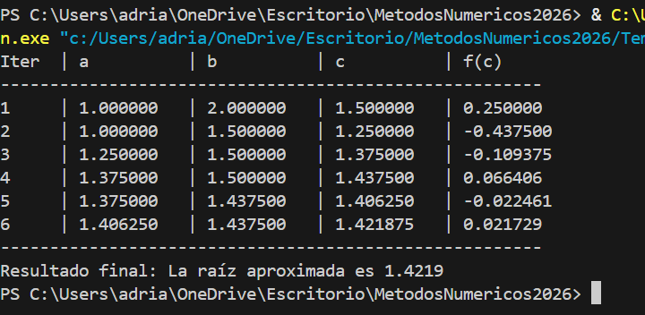

### ### Ejemplos Prácticos
* [Ejemplo 1: Función Polinomial](./Bisección/Ejemplo1.py)

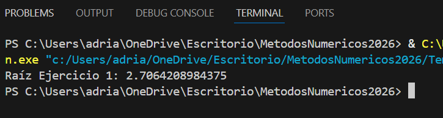

* [Ejemplo 2: Función Trigonométrica](./Bisección/Ejemplo2.py)

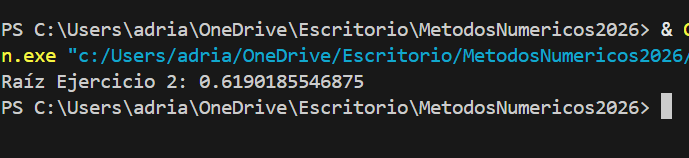

* [Ejemplo 3: Función Exponencial](./Bisección/Ejemplo3.py)

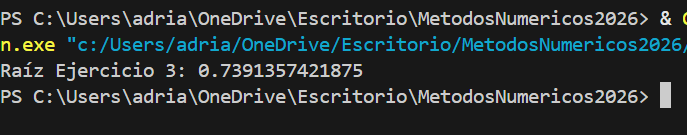

* [Ejemplo 4: Tolerancia Estricta](./Bisección/Ejemplo4.py)

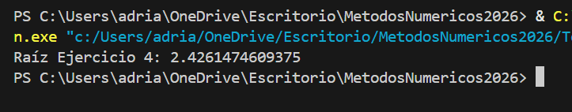

* [Ejemplo 5: Análisis de Convergencia](./Bisección/Ejemplo5.py)

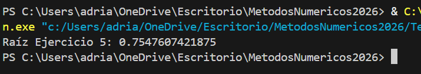

## Regla_Falsa

<b>Concepto</b>

Algoritmo utilizado para encontrar aproximaciones de las raíces de una función continua en un intervalo dado. A diferencia del método de bisección, el método de la regla falsa utiliza una interpolación lineal para estimar la ubicación de la raíz en cada iteración.

<b>Algoritmo</b>

1. Entrada de datos: Toma como entrada una función  f(x)  continua en un intervalo [a, b], donde  f(a) y f(b) tienen signos opuestos, y una tolerancia text{tol}  que determina la precisión deseada.

2. Inicialización: Define a  y  b  como los límites del intervalo, y calcula  f(a)  y  f(b).

3. Bucle de iteración:
     - Mientras el tamaño del intervalo (b - a) / 2 sea mayor que la tolerancia  text{tol} :
       - Calcula el punto c de intersección con el eje x utilizando la interpolación lineal:
       c = b - ((f(b)*(b - a))/(f(b) - f(a))
       - Evalúa f(c).
       - Si  f(c) es igual a cero (o está suficientemente cerca de cero según la tolerancia), devuelve c como la raíz.
       - Si f(a)/f(c) < 0, actualiza b = c.
       - De lo contrario, actualiza a = c.

4. Salida: Devuelve c como la aproximación de la raíz.

<b>Implementación</b>

* [Regla Falsa Base](./Regla%20Falsa/Ejemplo.py)

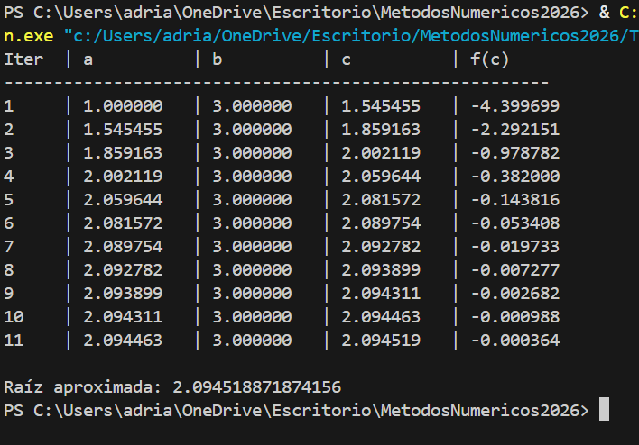

### ### Ejemplos Prácticos
* [Ejemplo 1: Aproximación de Raíz Real](./Regla%20Falsa/Ejemplo1.py)

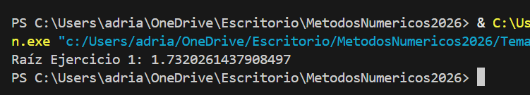

* [Ejemplo 2: Evaluación con Intervalo Estrecho](./Regla%20Falsa/Ejemplo2.py)

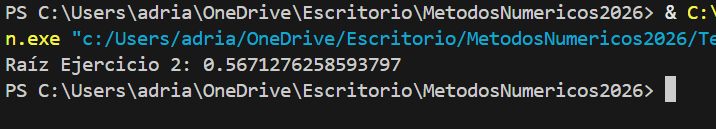

* [Ejemplo 3: Función de Rápido Crecimiento](./Regla%20Falsa/Ejemplo3.py)

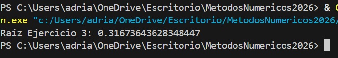

* [Ejemplo 4: Control de Tolerancia Mínima](./Regla%20Falsa/Ejemplo4.py)

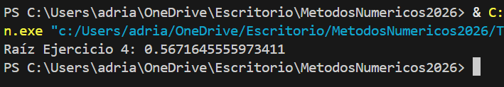

* [Ejemplo 5: Comparativa de Pasos de Convergencia](./Regla%20Falsa/Ejemplo5.py)

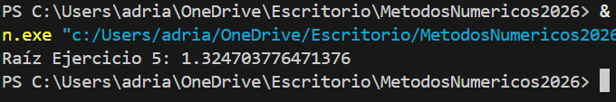
---

## Secante

  

<b>Concepto</b>

A diferencia de los métodos de intervalos como la regla falsa o la bisección, el método de la secante no requiere que la función cambie de signo en el intervalo dado. En cambio, utiliza dos aproximaciones iniciales para la raíz y calcula iterativamente una nueva aproximación utilizando una interpolación lineal entre los puntos definidos por las aproximaciones iniciales.

<b>Algoritmo</b>

1. Entrada de datos: Toma como entrada una función f(x)continua, dos aproximaciones iniciales x_0 y x_1  para la raíz, y una tolerancia tol que determina la precisión deseada.

2. Inicialización: Define x_0 y x_1 como las aproximaciones iniciales para la raíz.

3. Bucle de iteración:
   - Mientras no se alcance la tolerancia tol o un número máximo de iteraciones:
     - Calcula la siguiente aproximación de la raíz utilizando la fórmula:
       x_{n+1} = x_n - (f(x_n)*(x_n - x_{n-1})/(f(x_n) - f(x_{n-1})))
     - Comprueba si f(x_{n+1} < tol. Si es así, la aproximación x_{n+1} es aceptable y se detiene el algoritmo.
     - Actualiza x_{n-1} y x_n para la siguiente iteración.

4. Salida: Devuelve x{n+1} como la aproximación de la raíz.

<b>Implementación</b>

* [Secante Base](./Secante/Ejemplo.py)

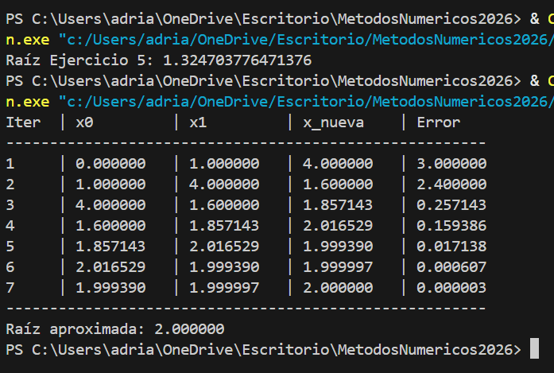

### ### Ejemplos Prácticos
* [Ejemplo 1: Raíz en Intervalo Definido](./Secante/Ejemplo1.py)

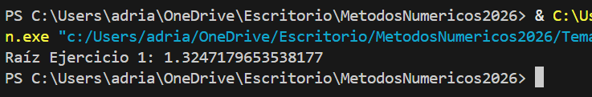

* [Ejemplo 2: Intersección de Funciones](./Secante/Ejemplo2.py)

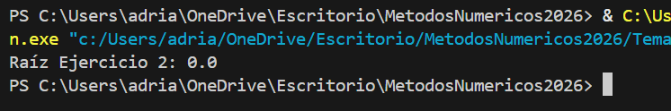

* [Ejemplo 3: Análisis de Funciones Logarítmicas](./Secante/Ejemplo3.py)

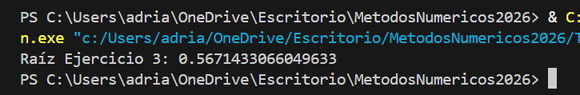

* [Ejemplo 4: Comportamiento en Curvas Pronunciadas](./Secante/Ejemplo4.py)

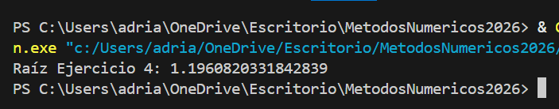

* [Ejemplo 5: Criterio de Parada por Tolerancia Absoluta](./Secante/Ejemplo5.py)

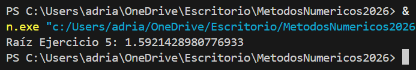

---

## Newton_Rapson

  

<b>Concepto</b>

El método de Newton-Raphson, también conocido como el método de Newton, es un algoritmo utilizado para encontrar raíces de funciones. Es un método iterativo que utiliza la derivada de la función para aproximarse a la raíz.
El concepto básico detrás del método de Newton-Raphson es usar la tangente a la curva de la función en un punto inicial como una aproximación lineal de la función. Luego, se encuentra la intersección de esta tangente con el eje 
x, que proporciona una mejor aproximación de la raíz de la función. Este proceso se repite iterativamente hasta que se alcance la precisión deseada.

<b>Algoritmo</b>

1. Entrada de datos: Toma como entrada una función  f(x) continua y diferenciable, una aproximación inicial  x_0 para la raíz, y una tolerancia tol que determina la precisión deseada.

2. Bucle de iteración:
   - Calcula la siguiente aproximación de la raíz utilizando la fórmula:
     x_{n+1} = x_n - (f(x_n)/f'(x_n))
     donde f'(x_n) es la derivada de f(x) evaluada en x_n.
   - Repite este paso hasta que |f(x_{n+1})| < tol, o hasta que se alcance un número máximo de iteraciones.

3. Salida: Devuelve x_{n+1} como la aproximación de la raíz.

<b>Implementación</b>

### ### Ejemplo de Referencia
* [Newton Raphson Base](./Newton/Ejemplo.py)

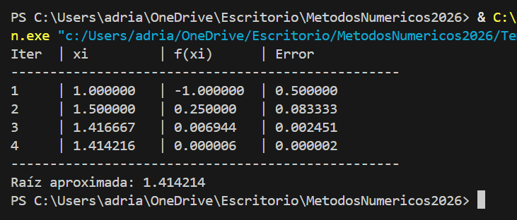

### ### Ejemplos Prácticos
* [Ejemplo 1: Raíz de Polinomio Cúbico](./Newton/Ejemplo1.py)

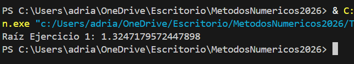

* [Ejemplo 2: Ecuación con Funciones Trascendentes](./Newton/Ejemplo2.py)

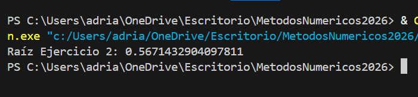

* [Ejemplo 3: Convergencia Rápida Cuadrática](./Newton/Ejemplo3.py)

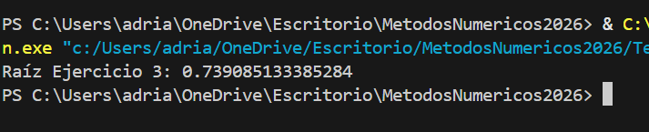

* [Ejemplo 4: Comportamiento Cerca de Máximos/Mínimos](./Newton/Ejemplo4.py)

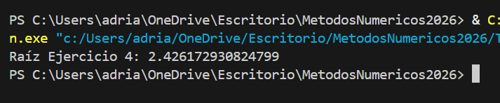

* [Ejemplo 5: Tolerancia de Alta Precisión](./Newton/Ejemplo5.py)

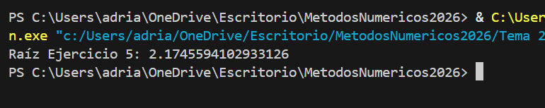

---