# Tema_3

## MÉTODO_DE_ELIMINACIÓN_GAUSSIANA

 ###                                         Concepto

El objetivo del método de Gauss es transformar un sistema de ecuaciones lineales en otro equivalente pero más fácil de resolver, como un sistema triangular o diagonal con ceros bajo la diagonal.

<b>Algoritmo</b>

1. Pivoteo:
   
   - En esta fase, se elige un elemento pivotante en cada iteración del algoritmo. El pivote es crucial porque guía el proceso de simplificación del sistema.
   
   - El pivote se selecciona para minimizar los errores numéricos y facilitar los cálculos. En el método de Gauss original, se elige como el primer elemento no nulo en cada columna, pero existen variantes como el pivoteo parcial o completo para mejorar la precisión numérica.
   
2. Eliminación:
   
   - Después de seleccionar el pivote, se utiliza para eliminar los coeficientes debajo de él en la misma columna, haciendo que sean cero. Esto simplifica el sistema al eliminar incógnitas de ecuaciones adicionales.
   
   - La eliminación se realiza restando múltiplos adecuados de la fila del pivote a otras filas. Esto se repite hasta que la matriz se convierte en una forma triangular superior, donde todos los elementos debajo de la diagonal principal son ceros.
   
3. Sustitución hacia atrás:
   
   - Con la matriz en forma triangular superior, se pueden resolver las incógnitas fácilmente utilizando el método de sustitución hacia atrás.
   
   - Comenzando desde la última fila, las soluciones de las variables se calculan sucesivamente utilizando los valores ya calculados de las variables hacia abajo en la matriz.

<b>Implementación</b>

### ### Ejemplo de Referencia

* [Eliminación Gaussiana Base](./Eliminación%20Gaussiana/Ejemplo.py)

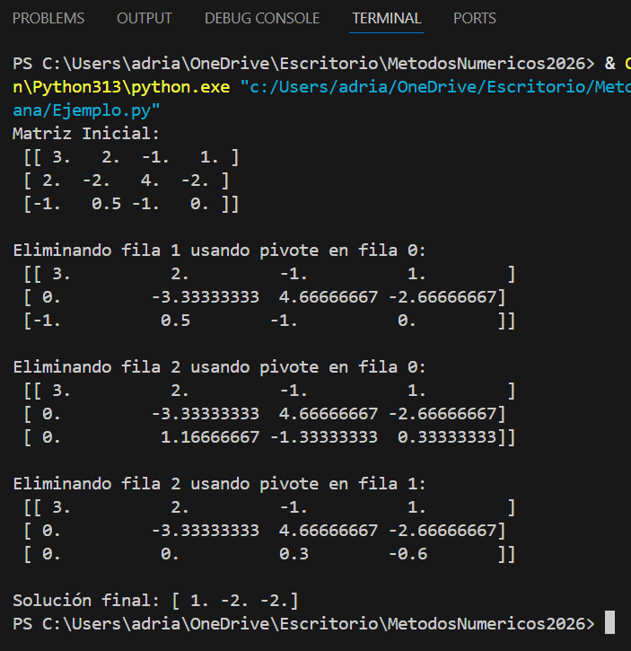

### ### Ejemplos Prácticos
* [Ejemplo 1: Sistema de 3x3 Determinado](./Eliminación%20Gaussiana/Ejemplo1.py)

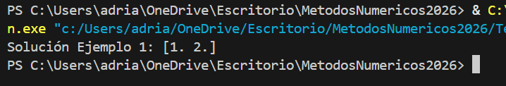

* [Ejemplo 2: Matriz con Pivoteo Parcial](./Eliminación%20Gaussiana/Ejemplo2.py)

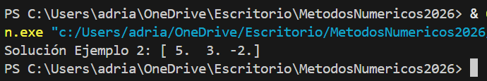

* [Ejemplo 3: Análisis de Sistema con Solución Única](./Eliminación%20Gaussiana/Ejemplo3.py)

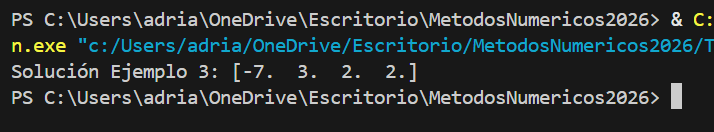

---

## MÉTODO_DE_GAUSS_JORDAN

<b>Concepto</b>

El método de Gauss-Jordan es un algoritmo numérico utilizado para resolver sistemas de ecuaciones lineales. Su objetivo principal es llevar una matriz aumentada que representa el sistema de ecuaciones a su forma escalonada reducida por filas, obteniendo una matrz identidad. 

<b>Algoritmo</b>

1. Pivoteo Parcial:
   
   - Selecciona el pivote actual como el elemento más grande en valor absoluto en la columna actual, comenzando desde la fila actual y hacia abajo.
  
   - Intercambia las filas de tal manera que la fila del pivote (la fila actual) se coloque en la posición donde se encuentra el máximo elemento.

2. Hacer el Pivote Igual a 1:
   
    - Divide toda la fila del pivote por el valor del pivote para hacer que el elemento diagonal (el pivote) sea igual a 1.

3.  Hacer Ceros por Debajo y por encima del Pivote:
   
    - Para cada fila que esté debajo y por encima del pivote, resta múltiplos adecuados de la fila del pivote para hacer cero los elementos en la columna actual.

4. Repetición:

   - Repite los pasos anteriores para el siguiente pivote y continúa hasta que se hayan procesado todas las filas y columnas.

5. Solución:

   - Una vez que la matriz está en su forma escalonada reducida, las últimas columnas representan las soluciones del sistema de ecuaciones lineales.
   

<b>Implementación</b>

* [Gauss-Jordan Base](./Gauss%20Jordan/Ejemplo.py)

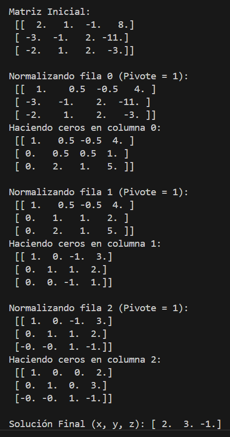

### ### Ejemplos Prácticos
* [Ejemplo 1: Sistema de 3x3 Totalmente Determinado](./Gauss%20Jordan/Ejemplo1.py)

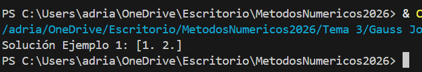

* [Ejemplo 2: Matriz Inversa por Gauss-Jordan](./Gauss%20Jordan/Ejemplo2.py)

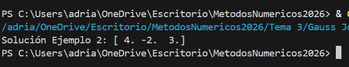

* [Ejemplo 3: Análisis de Matrices No Singulares](./Gauss%20Jordan/Ejemplo3.py)

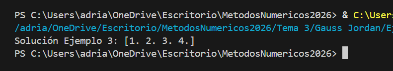
---

## Metodo_de_Gauss-Seidel

<b>Concepto</b>

El método de Gauss-Seidel es una técnica iterativa para resolver sistemas de ecuaciones lineales. En lugar de calcular todas las incógnitas simultáneamente como en el método de eliminación gaussiana, Gauss-Seidel calcula cada incógnita secuencialmente utilizando valores actualizados a medida que avanza en las iteraciones. Esto hace que el método sea especialmente útil para matrices grandes y dispersas.

El proceso comienza con una aproximación inicial de las soluciones del sistema. Luego, en cada iteración, Gauss-Seidel actualiza las soluciones basándose en las estimaciones previas, utilizando los valores recientemente calculados para las incógnitas. Este enfoque iterativo continúa hasta que se alcanza un cierto criterio de convergencia, como una tolerancia predefinida o un número máximo de iteraciones.

<b>Algoritmo</b>

1. Descomposición de la matriz: Dada una matriz A de coeficientes y un vector b de términos independientes, se descompone A en dos matrices: L, la parte triangular inferior de A (incluida la diagonal); y U, la parte triangular superior de A sin incluir la diagonal.

2. Inicialización: Se elige una estimación inicial x^(0).

3. Iteraciones: Se itera el proceso hasta que se alcance una precisión deseada o un número máximo de iteraciones. En cada iteración:

   a. Se actualiza cada componente de x utilizando la fórmula iterativa:
   
       x_i^(k+1) = 1/a_ij (b_i − ∑_j=1^i−1 a_ij*x_j^(k+1) −∑_j=i+1^n a _ij*x_j^(k))

   b. Se comprueba si se ha alcanzado la precisión deseada. Si es así, se detiene el proceso. Si no, se continúa a la siguiente iteración.

4. Salida: La solución aproximada x ^(k) se toma como la solución del sistema de ecuaciones lineales Ax=b.

### ### Ejemplo de Referencia
* [Gauss-Seidel Base](./Gauss%20Seidel/Ejemplo.py)

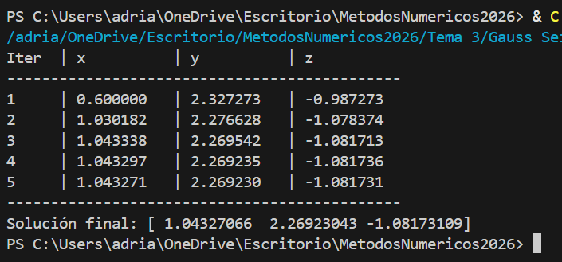

### ### Ejemplos Prácticos
* [Ejemplo 1: Matriz Diagonalmente Dominante](./Gauss%20Seidel/Ejemplo1.py)

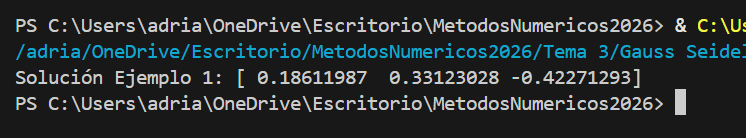

* [Ejemplo 2: Evaluación con Criterio de Tolerancia](./Gauss%20Seidel/Ejemplo2.py)

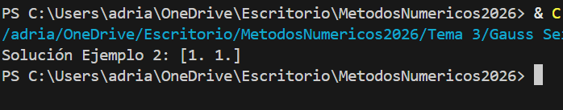

* [Ejemplo 3: Análisis de Convergencia Iterativa](./Gauss%20Seidel/Ejemplo3.py)

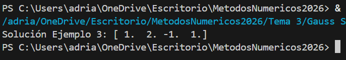

---

## Metodo_de_Jacobi

<b>Concepto</b>

El método de Jacobi es un algoritmo utilizado para resolver sistemas de ecuaciones lineales. Es uno de los métodos iterativos más simples y antiguos para resolver este tipo de problemas. Fue desarrollado por el matemático alemán Carl Gustav Jacobi en el siglo XIX.

La idea básica detrás del método de Jacobi es descomponer el sistema de ecuaciones lineales Ax=b en una suma de dos matrices: una matriz diagonal D y una matriz no diagonal R. Entonces, el sistema se convierte en dos ecuaciones:
Dx=(L+U)x=b

El método de Jacobi es un algoritmo utilizado para resolver sistemas de ecuaciones lineales. Es uno de los métodos iterativos más simples y antiguos para resolver este tipo de problemas. Fue desarrollado por el matemático alemán Carl Gustav Jacobi en el siglo XIX.

Donde L es la parte triangular inferior de A (con todos los elementos por encima de la diagonal principal iguales a cero) y U es la parte triangular superior de A (con todos los elementos por debajo de la diagonal principal iguales a cero).

El método de Jacobi procede iterativamente a partir de una estimación inicial 
x^(0). En cada iteración, calcula una nueva estimación x^(k+1) utilizando la siguiente fórmula:

    x^(k+1) = D^−1 (b−Rx^(k))

Donde D^−1 es la matriz inversa de D.

El proceso se repite hasta que se alcanza una precisión deseada o hasta que se alcanza un número máximo de iteraciones.

<b>Algoritmo</b>

1. Descomposición de la matriz: Dada una matriz A de coeficientes y un vector b de términos independientes, se descompone A en tres matrices: D, la matriz diagonal de A; L, la parte triangular inferior de A; y U, la parte triangular superior de A.

2. Inicialización: Se elige una estimación inicial x^(0).

3. Iteraciones: Se itera el proceso hasta que se alcance una precisión deseada o un número máximo de iteraciones. En cada iteración:
   
    a. Se calcula x^(k+1) utilizando la fórmula iterativa:

       x^(k+1) = D^−1 (b−Rx^(k))

    b. Se comprueba si se ha alcanzado la precisión deseada. Si es así, se detiene el proceso. Si no, se continúa a la siguiente iteración.

4. Salida: La solución aproximada x^(k) se toma como la solución del sistema de ecuaciones lineales Ax=b.

   

<b>Implementación</b>

### ### Ejemplo de Referencia
* [Jacobi Base](./Jacobi/Ejemplo.py)

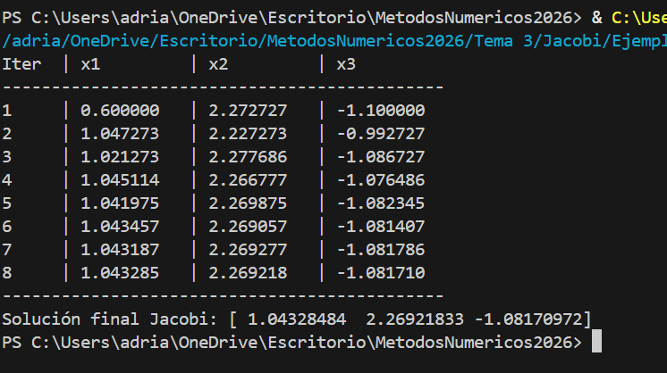

### ### Ejemplos Prácticos
* [Ejemplo 1: Matriz de Coeficientes Simétrica](./Jacobi/Ejemplo1.py)

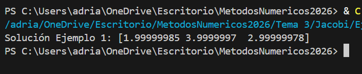

* [Ejemplo 2: Evaluación de Convergencia con Épsilon](./Jacobi/Ejemplo2.py)

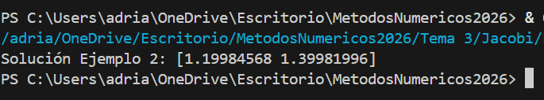

* [Ejemplo 3: Análisis comparativo de Velocidad Iterativa](./Jacobi/Ejemplo3.py)

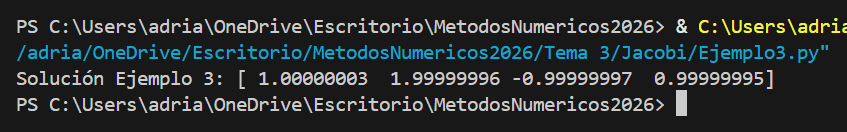

---