# Tema_4

### 🎥 Video de Demostración del Tema 4

> **Nota:** Si el video no se reproduce automáticamente, puedes [descargarlo aquí](./img/Video_T4.mp4).

## Metodos_de_diferenciación

### Regla_de_tres_puntos

#### Concepto

La regla de los tres puntos de diferenciación es una técnica utilizada en métodos numéricos para calcular aproximaciones de derivadas de una función. La idea básica detrás de esta regla es utilizar los valores de la función en tres puntos cercanos para estimar la derivada en un punto específico.
Formula:

    F′( X )≈ (− f ( x + 2 h ) + 4 f ( x + h ) − 3 f ( x ))/2 horas

#### Algoritmo

El algoritmo para aplicar esta regla en un conjunto de datos sería:

  1. Escoger un valor pequeño para ℎ.
  2. Para cada punto en los datos, calcular la aproximación de la derivada utilizando la fórmula mencionada anteriormente.
  3. Repetir el paso 2 para todos los puntos en los datos.

### ### Ejemplo de Referencia
* [Regla de 3 Puntos Base](./Regla%20de%203%20Puntos/Ejemplo.py)

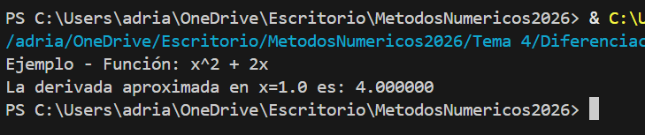

### ### Ejemplos Prácticos
* [Ejemplo 1: Diferencia Central en un Polinomio](./Regla%20de%203%20Puntos/Ejemplo1.py)

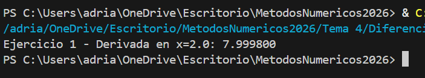

* [Ejemplo 2: Aproximaciones Progresivas y Regresivas en Fronteras](./Regla%20de%203%20Puntos/Ejemplo2.py)

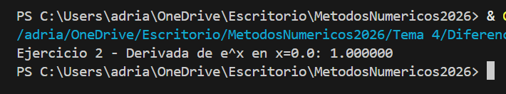

* [Ejemplo 3: Análisis de Sensibilidad al Tamaño de Paso (h)](./Regla%20de%203%20Puntos/Ejemplo3.py)

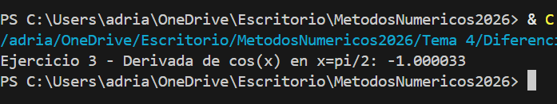

---

### Regla_de_cinco_puntos

#### Concepto

La regla de los cinco puntos es otra técnica utilizada en métodos numéricos para aproximar la derivada de una función en un punto específico. Al igual que la regla de los tres puntos, esta regla también utiliza los valores de la función en Múltiples puntos cercanos para calcular la derivada. La principal diferencia es que la regla de los cinco puntos utiliza cinco puntos en lugar de tres, lo que puede proporcionar una aproximación más precisa de la derivada.
Formula:

    F′( X )≈ (− f ( x + 2 h ) + 8 f ( x + h ) − 8 f ( x − h ) + f ( x − 2 h ))/12 horas

#### Algoritmo

  1. Escoger un valor pequeño para ℎ
  2. Para cada punto en los datos, calcular la aproximación de la derivada utilizando la fórmula mencionada anteriormente.
  3. Repetir el paso 2 para todos los puntos en los datos.
     
Al igual que con la regla de los tres puntos, la precisión de esta aproximación depende del tamaño de ℎ
Se debe encontrar un valor óptimo para ℎ dependiendo de la función y los datos específicos.

### ### Ejemplo de Referencia
* [Regla de 5 Puntos Base](./Regla%20de%205%20Puntos/Ejemplo.py)

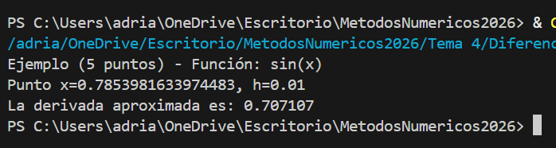

### ### Ejemplos Prácticos
* [Ejemplo 1: Derivada de Función Polinomial](./Regla%20de%205%20Puntos/Ejemplo1.py)

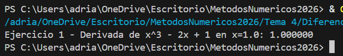

* [Ejemplo 2: Evaluación en Funciones Trigonométricas](./Regla%20de%205%20Puntos/Ejemplo2.py)

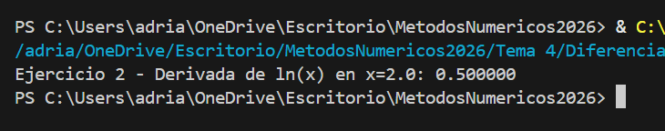

* [Ejemplo 3: Análisis de Error frente a Diferencias Centrales](./Regla%20de%205%20Puntos/Ejemplo3.py)

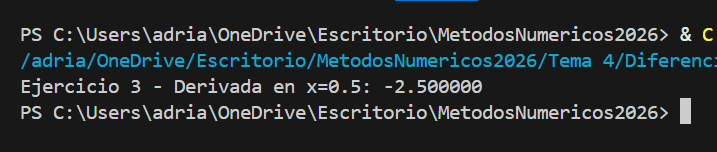
---

## Metodos_de_integración

### Metodo_del_Trapecio

#### Concepto

La regla del trapecio es la primera de las fórmulas cerradas de integración de Newton-Cotes, Geométricamente, la regla del trapecio es equivalente a
aproximar el área del trapecio bajo la línea recta que une f(a) y
f(b).
Formula: 

    I = (b-a)((f(a)+f(b))/2)

#### Algoritmo

  1. Definir la función 𝑓(𝑥) que se desea integrar.
  2. Especificar los límites de integración 𝑎 y 𝑏.
  3. Elegir el número de subintervalos 𝑛.
  4. Calcular ℎ = 𝑏−𝑎/𝑛.
  5. Calcular 𝑓(𝑎) y 𝑓(𝑏)
  6. Para cada 𝑖 = 1, 2,..., 𝑛−1.
    * Calcular 𝑥𝑖 = 𝑎 + 𝑖 ⋅ ℎ.
    * Calcular 𝑓(𝑥𝑖).
  7. Sumar 𝑓(𝑎), 2∑𝑖=1, 𝑛−1,𝑓(𝑥𝑖) y 𝑓(𝑏).
  8. Multiplicar la suma por ℎ/2 para obtener la aproximación de la integral.

### ### Ejemplo de Referencia
* [Método del Trapecio Base](./Trapecio/Ejemplo.py)

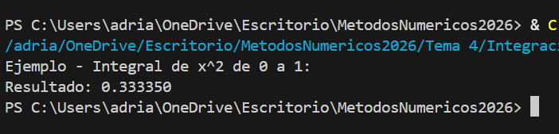

### ### Ejemplos Prácticos
* [Ejemplo 1: Regla del Trapecio Simple](./Trapecio/Ejemplo1.py)

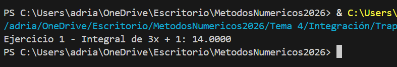

* [Ejemplo 2: Regla del Trapecio Compuesta con n Subintervalos](./Trapecio/Ejemplo2.py)

* [Ejemplo 3: Análisis de Convergencia del Error del Trapecio](./Trapecio/Ejemplo3.py)

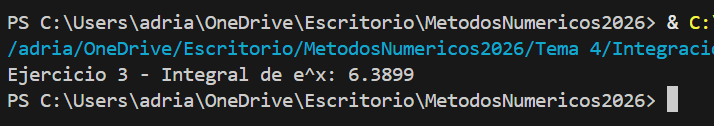

---

### Regla_de_Simpson

#### Concepto

La regla de Simpson es un método de cálculo numérico utilizado para aproximar el valor de una integral definida. Este método utiliza polinomios de segundo grado (también conocidos como parábolas) para aproximar la función integrada en cada subintervalo del intervalo dado. La regla de Simpson es más precisa que el método del trapecio, especialmente para funciones que son relativamente suaves o que se pueden aproximar segundo bien con polinomios de grado.
Formula:

    I ≅ (b–a)((f(x0)+4f(x)+f(x2))/6)

#### Algoritmo

  1. Definir la función 𝑓(𝑥) que se desea integrar.
  2. Especificar los límites de integración 𝑎 y 𝑏.
  3. Elegir el número de puntos de integración 𝑛 (debe ser par).
  4. Calcular ℎ = 𝑏−𝑎/𝑛.
  5. Calcular 𝑓(𝑎) y 𝑓(𝑏)
  6. Para cada 𝑖 = 1, 2,..., 𝑛−1.
    * Calcular 𝑥𝑖 = 𝑎 + 𝑖 ⋅ ℎ.
    * Calcular 𝑓(𝑥𝑖).
  7. Sumar 𝑓(𝑎), 4∑𝑖=1, 𝑛/2, 𝑓(𝑥2𝑖-1), 2∑𝑖=1, 𝑛/2-1, 𝑓(𝑥2𝑖) y 𝑓(𝑏).
  8. Multiplicar la suma por ℎ/3 para obtener la aproximación de la integral.

### ### Ejemplo de Referencia
* [Método de Simpson Base](./Simpson/Ejemplo.py)

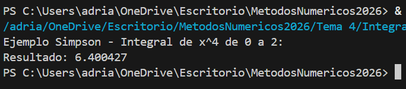

### ### Ejemplos Prácticos
* [Ejemplo 1: Regla de Simpson 1/3 Compuesta](./Simpson/Ejemplo1.py)

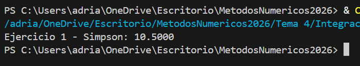

* [Ejemplo 2: Regla de Simpson 3/8 para Intervalos Impares](./Simpson/Ejemplo2.py)

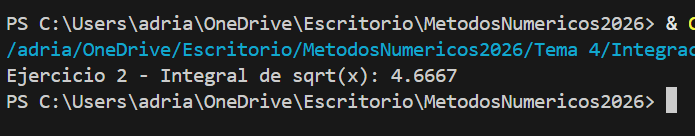

* [Ejemplo 3: Comparación de Errores vs Regla del Trapecio](./Simpson/Ejemplo3.py)

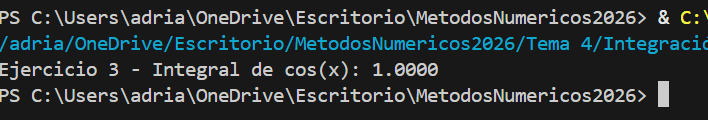

---

### Método_de_la_cuadratura_gaussiana

#### Concepto

El método de cuadratura gaussiana, o simplemente cuadratura gaussiana, es una técnica utilizada en el cálculo numérico para aproximar el valor de una integral definida. La cuadratura gaussiana se basa en la idea de seleccionar cuidadosamente los puntos de evaluación y los pesos asociados para lograr una alta precisión en la aproximación de la integral.
Formula:

    ∫a,b f(x)dx≈∑i=1,n; wi ⋅ f(xi)

#### Algoritmo

  1. Selección de los puntos de integración y sus pesos:
    Este paso implica elegir los puntos de integración 𝑥𝑖 y los pesos 𝑤𝑖 adecuados para la función y el intervalo dados. La elección de estos puntos y pesos depende del grado del polinomio que se desea integrar de manera exacta.
  2. Cálculo de la aproximación de la integral:
     Una vez que se han determinado los puntos de integración y sus pesos, la aproximación de la integral se calcula evaluando la función 𝑓(𝑥) en estos puntos y multiplicándola por los pesos correspondientes, y luego sumando estos productos.

### ### Ejemplo de Referencia
* [Cuadratura Gaussiana Base](./Cuadratura%20Gaussiana/Ejemplo.py)

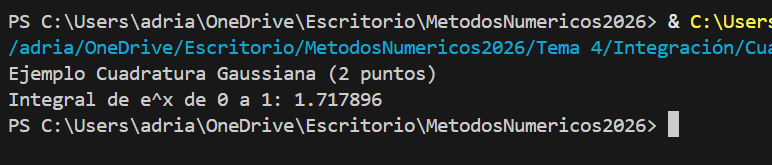

### ### Ejemplos Prácticos
* [Ejemplo 1: Integración con 2 y 3 Puntos de Gauss](./Cuadratura%20Gaussiana/Ejemplo1.py)

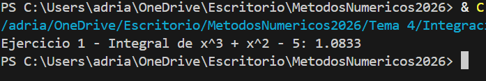

* [Ejemplo 2: Cambio de Intervalo de Integración a [-1, 1]](./Cuadratura%20Gaussiana/Ejemplo2.py)

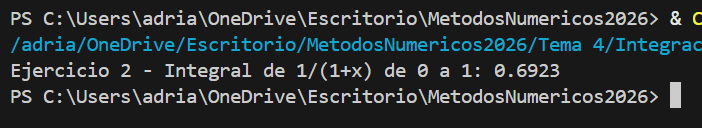

* [Ejemplo 3: Análisis de Precisión en Funciones Complejas](./Cuadratura%20Gaussiana/Ejemplo3.py)

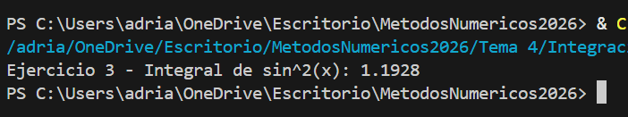
---