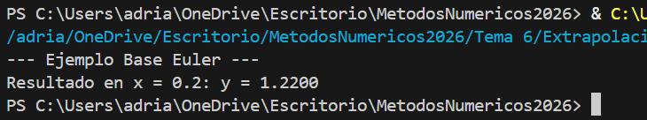
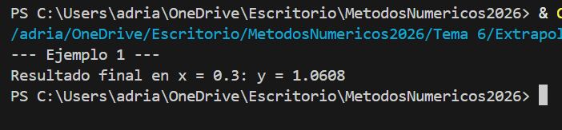
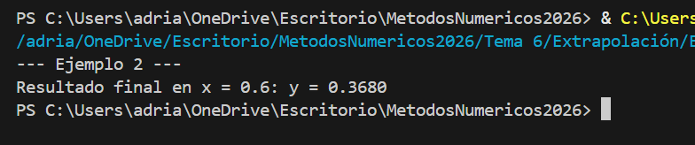
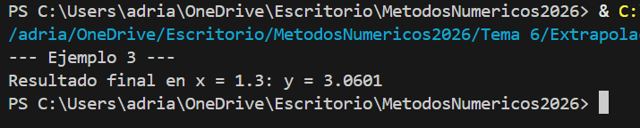
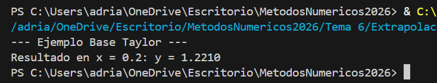
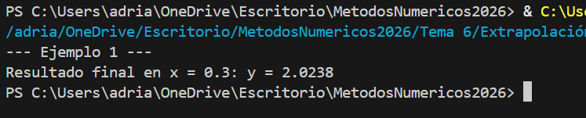
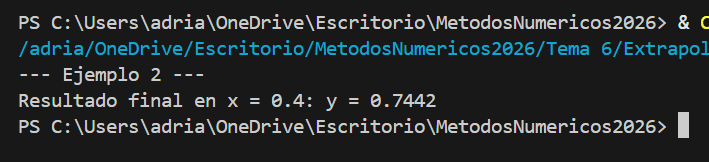
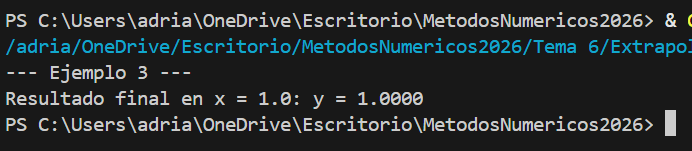

# Tema_6

## Introducción

El presente trabajo ofrece una exploración detallada de la aplicación de métodos numéricos para la resolución de ecuaciones diferenciales en el entorno de programación Java. Se abordan tres métodos fundamentales: Euler, Runge-Kutta y Taylor. A través de ejemplos prácticos, se ilustra cómo estas técnicas pueden implementarse eficazmente para resolver una amplia gama de problemas.

## Metodos_de_extrapolación
### Euler
#### Concepto

El método de Euler es un algoritmo numérico utilizado para aproximar soluciones de ecuaciones diferenciales ordinarias (EDOs) mediante la integración numérica. Se basa en la idea de que la pendiente de la función en un punto dado puede utilizarse para predecir su valor en el siguiente punto. El método descompone la EDO en pequeños pasos, utilizando la pendiente en el punto actual para estimar el cambio en la función y así calcular su valor en el siguiente punto. Aunque es simple y fácil de implementar, el método de Euler puede no ser muy preciso para ciertos tipos de ecuaciones o para tamaños de paso grandes. Sin embargo, sigue siendo un punto de partida común para comprender y desarrollar métodos más avanzados de integración numérica.


#### Algoritmo

```java
    1. Declarar x0 como el límite inferior (lim inf).
    2. Declarar xf como el límite superior (lim sup).
    3. Declarar deltaX como el tamaño de paso.
    4. Declarar y0 como la condición inicial.
    5. Calcular el número de pasos (steps) como Entero ((xf - x0) / deltaX).
    6. Declarar un arreglo x de tamaño (steps + 1) para almacenar los valores de x.
    7. Declarar un arreglo y de tamaño (steps + 1) para almacenar los valores de y.
    8. Declarar un arreglo exactY de tamaño (steps + 1) para almacenar los valores de la solución exacta.
    9. Asignar las condiciones iniciales:
        - x[0] = x0
        - y[0] = y0
        - exactY[0] = solExac(x0)
    10. Iterar desde 0 hasta steps:
        a. Calcular el siguiente valor de x: x[i + 1] = x[i] + deltaX.
        b. Calcular el siguiente valor de y utilizando la fórmula de Euler: y[i + 1] = y[i] + deltaX * f(x[i]).
        c. Calcular el valor exacto de la solución en x[i + 1]: exactY[i + 1] = solExac(x[i + 1]).
    11. Imprimir las iteraciones en formato de tabla.
```

### ### Ejemplo de Referencia
* [Método de Euler Base](./Euler/Ejemplo.py)



### ### Ejemplos Prácticos
* [Ejemplo 1: Solución de un PVI Lineal de Primer Grado](./Euler/Ejemplo1.py)



* [Ejemplo 2: Análisis del Impacto del Tamaño de Paso (h) en la Estabilidad](./Euler/Ejemplo2.py)



* [Ejemplo 3: Estimación y Gráfica del Error Global de Truncamiento](../Euler/Ejemplo3.py)



---

### Runge-Kutta
#### Concepto

Es un algoritmo numérico utilizado para aproximar soluciones de ecuaciones diferenciales ordinarias (EDOs). 
Es especialmente útil cuando se busca una mayor precisión que la proporcionada por métodos más simples como el de Euler. 
Este método utiliza múltiples evaluaciones ponderadas de la función en cada paso para mejorar la aproximación de la solución. 
En el contexto del programa proporcionado, el método de Runge-Kutta de cuarto orden se implementa para calcular los valores aproximados de la solución de la EDO en diferentes puntos dentro de un intervalo dado.

#### Algoritmo

```java
    1. Inicializar las condiciones iniciales: y0 y x0.
    2. Definir el tamaño del paso (Δx) y el número de pasos (iteraciones).
    3. Crear arreglos para almacenar los valores de x, y y la solución exacta en cada iteración.
    4. Asignar los valores iniciales a los arreglos.
    5. Iterar desde 0 hasta el número de pasos:
       - Calcular el siguiente valor de x: xi+1 = xi + Δx.
       - Calcular los coeficientes k1, k2, k3 y k4 utilizando la función f(x).
       - Utilizar los coeficientes para calcular el siguiente valor de y utilizando la fórmula de Runge-Kutta de cuarto orden: yi+1 = yi + (1/6)*(k1 + 2*k2 + 2*k3 + k4).
       - Calcular el valor exacto de la solución en xi+1.
    6. Mostrar los resultados, mostrando x, la solución exacta y la solución aproximada obtenida con el método de Runge-Kutta en cada iteración.
```

### ### Ejemplo de Referencia
* [Método de Runge-Kutta Base](./Runge-Kutta/Ejemplo.py)


### ### Ejemplos Prácticos
* [Ejemplo 1: Solución de EDO de Alta Precisión](./Runge-Kutta/Ejemplo1.py)


* [Ejemplo 2: Comparativa de Convergencia RK4 vs Euler](../Runge-Kutta/Ejemplo2.py)


* [Ejemplo 3: Aplicación a un Modelo Físico/Dinámico](../Runge-Kutta/Ejemplo3.py)


---

### Taylor

#### Concepto

Es una técnica numérica utilizada para resolver ecuaciones diferenciales ordinarias (EDOs) mediante la expansión de la solución en una serie de Taylor alrededor de un punto. Este método se basa en utilizar las derivadas sucesivas de la función en el punto inicial para construir una serie que aproxima la solución de la ecuación diferencial.
La idea principal es que la solución de una EDO puede ser expresada como una suma infinita de términos que involucran las derivadas de la función evaluadas en el punto inicial. En la práctica, se trunca la serie de Taylor después de un número finito de términos, lo que proporciona una aproximación de la solución.

#### Algoritmo

```java
    1. Declarar x0 como el límite inferior (lim inf).
    2. Declarar xf como el límite superior (lim sup).
    3. Declarar deltaX como el tamaño de paso.
    4. Declarar y0 como la condición inicial.
    5. Calcular el número de pasos (steps) como Entero ((xf - x0) / deltaX).
    6. Declarar un arreglo x de tamaño (steps + 1) para almacenar los valores de x.
    7. Declarar un arreglo y de tamaño (steps + 1) para almacenar los valores de y.
    8. Declarar un arreglo exactY de tamaño (steps + 1) para almacenar los valores de la solución exacta.
    9. Asignar las condiciones iniciales:
        x[0] = x0
        y[0] = y0
        exactY[0] = solExac(x0)
    10. Iterar desde 0 hasta steps:
        a. Calcular el siguiente valor de x: x[i + 1] = x[i] + deltaX.
        b. Calcular el siguiente valor de y utilizando la fórmula de Taylor:
           y[i + 1] = y[i] + deltaX * f(x[i]) + (deltaX^2 / 2!) * f'(x[i]) + (deltaX^3 / 3!) * f''(x[i]) + (deltaX^4 / 4!) * f'''(x[i]).
        c. Calcular el valor exacto de la solución en x[i + 1]: exactY[i + 1] = solExac(x[i + 1]).
    11. Imprimir las iteraciones en formato de tabla.
```

### ### Ejemplo de Referencia
* [Método de Series de Taylor Base](./Taylor/Ejemplo.py)



### ### Ejemplos Prácticos
* [Ejemplo 1: Aproximación de Segundo Orden](./Taylor/Ejemplo1.py)



* [Ejemplo 2: Análisis de Convergencia al Incrementar el Grado del Polinomio](./Taylor/Ejemplo2.py)



* [Ejemplo 3: Comparativa de Error Residual vs Solución Analítica](./Taylor/Ejemplo3.py)


---